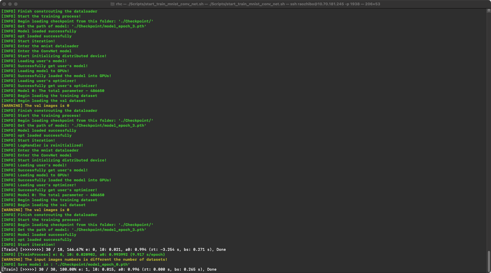
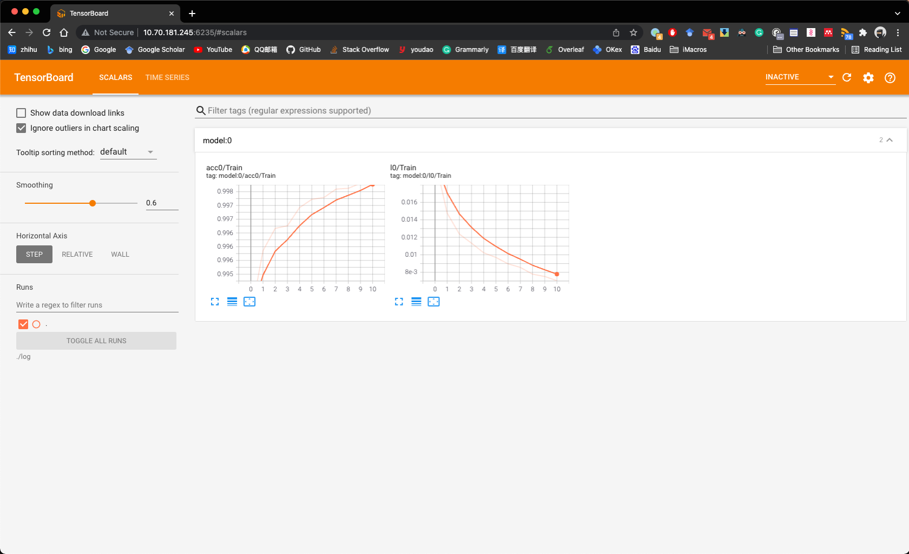

# FrameworkTemplate
[](https://github.com/Archaic-Atom/FrameworkTemplate/actions/workflows/build_env.yml)


>This is template project for JackFramework (https://github.com/Archaic-Atom/JackFramework). **It is used to rapidly build the model, without caring about the training process (such as DDP or DP, Tensorboard, et al.)**
---
### Software Environment
1. OS Environment
```
os >= linux 16.04
cudaToolKit == 10.1
cudnn == 7.3.6
```

2. Python Environment (We provide the whole env in )
```
python >= 3.8.5
pythorch >= 1.15.0
numpy >= 1.14.5
opencv >= 3.4.0
PIL >= 5.1.0
```
---
### Hardware Environment
The framework only can be used in GPUs.

### Train the model by running:
0. Install the JackFramework lib from Github (https://github.com/Archaic-Atom/JackFramework)
```
$ cd JackFramework/
$ ./install.sh
```

2. Run the program, like:
```
$ ./Scripts/start_train_mnist_conv_net.sh
```

3. Kill the program, like:
```
$ ./Scripts/kill_process.sh
```
---

### Screenshot
1. the code in terminal



2. the usage of GPUs


3. the tensorboard



### File Structure
```
.
├── Source # source code
│   ├── UserModelImplementation
│   │   ├── Models            # any models in this folder
│   │   ├── Dataloaders       # any dataloader in this folder
│   │   └── user_interface.py # to use model and Dataloader
│   ├── Tools
│   ├── main.py
│   └── ...
├── Datasets # Get it by ./GenPath.sh, you need build folder
│   ├── kitti2012_val_list.csv.txt
│   ├── kitti2015_val_list.csv.txt
│   └── ...
├── Result # The data of Project. Auto Bulid
│   ├── output.log
│   ├── train_acc.csv
│   └── ...
├── ResultImg # The image of Result. Auto Bulid
│   ├── 000001_10.png
│   ├── 000002_10.png
│   └── ...
├── Checkpoints # The saved model. Auto Bulid
│   ├── checkpoint
│   └── ...
├── log # The graph of model. Auto Bulid
│   ├── events.out.tfevents.1541751559.ubuntu
│   └── ...
├── Scripts # shell cmd
│   ├──GetPath.sh
│   ├──Pre-Train.sh
│   └── ...
├── LICENSE
└── README.md
```

---
### Update log
#### 2021-12-04
1. Add a demo for mnist;