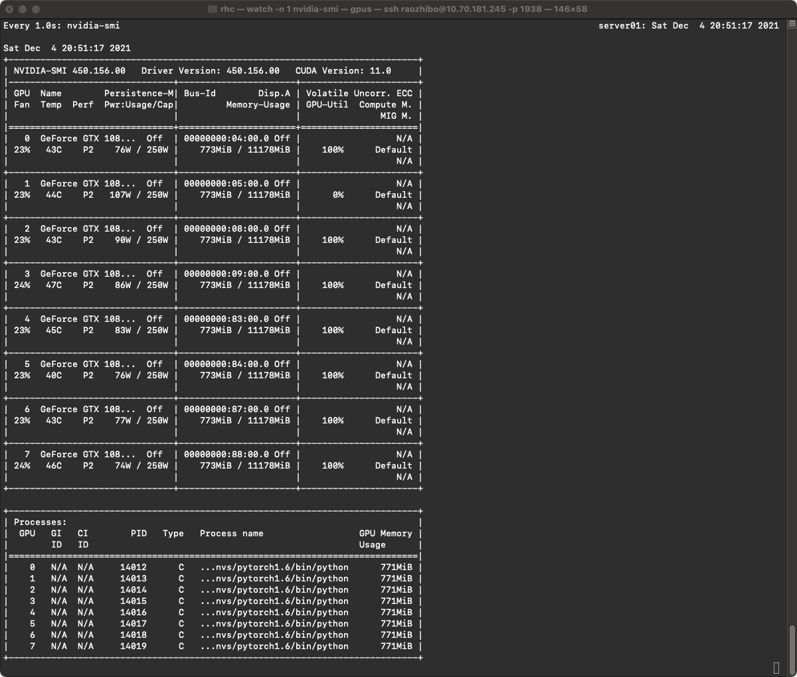

# Demo-jf
[](https://github.com/Archaic-Atom/FrameworkTemplate/actions/workflows/build_env.yml)


>This is template project for JackFramework (https://github.com/Archaic-Atom/JackFramework). **It is used to rapidly build the model, without caring about the training process (such as DDP or DP, Tensorboard, et al.)**

Document：https://www.wolai.com/archaic-atom/rqKJVi7M1x44mPT8CdM1TL

Demo Project: https://github.com/Archaic-Atom/Demo-jf

---
### Software Environment
1. OS Environment
```
os >= linux 16.04
cudaToolKit == 10.1
cudnn == 7.3.6
```

2. Python Environment (We provide the whole env in )
```
python >= 3.8.5
pythorch >= 1.15.0
numpy >= 1.14.5
opencv >= 3.4.0
PIL >= 5.1.0
```
---
### Hardware Environment
The framework only can be used in GPUs.

### Train the model by running:
1. Install the JackFramework lib from Github (https://github.com/Archaic-Atom/JackFramework)
```
$ cd JackFramework/
$ ./install.sh
```

2. Run the program, like:
```
$ ./Scripts/start_train_mnist_conv_net.sh
```

3. Kill the program, like:
```
$ ./Scripts/kill_process.sh
```
---

### Screenshot
1. the code in terminal


2. the usage of GPUs



3. the tensorboard


### File Structure
```
Demo-jf
├── Datasets # Get it by ./generate_path.sh, you need build folder
│   ├── mnist_dataset.csv
│   └── ...
├── Scripts # Get it by ./generate_path.sh, you need build folder
│   ├── clean.sh         # clean the project
│   ├── start_train_mnist_conv_net.sh # start training command
│   └── ...
├── Source # source code
│   ├── UserModelImplementation
│   │   ├── Models            # any models in this folder
│   │   │   └── ConvNet
│   │   │       ├── inference.py
│   │   │       └── model.py
│   │   ├── Dataloaders       # any dataloaders in this folder
│   │   │   └── mnist_dataloader.py
│   │   ├── user_define.py    # any global variable in this fi
│   │   └── user_interface.py # to use model and Dataloader
│   ├── Tools # put some tools in this folder
│   ├── main.py
│   └── ...
├── LICENSE
└── README.md
```

---
### Update log
#### 2021-12-04
1. Add a demo for mnist;